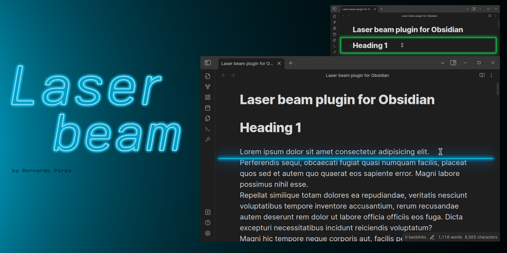
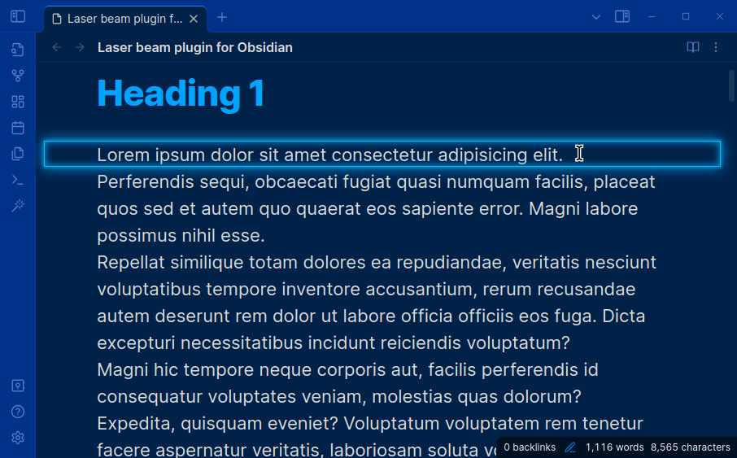

# Laser beam plugin for Obsidian

> [!IMPORTANT]
> **This repository has been archived.**
>
> This project will no longer receive active development or support.
>
> The code remains available for reference.
>
> Thank you for your past interest.

**Laser beam** is a plugin for Obsidian.md designed to enhance your reading experience by utilizing customizable laser lines.  These lines are virtual guides meant to improve reading focus and concentration.

## Overview and Features

> Default theme - laser line (blue)

- **Customizable Laser Lines**: You can choose between 2 laser focus types, **laser line** or **laser area**, to personalize your reading experience and find what works best for you.

> Default theme - laser area (green)

- **Improved Focus**: The laser lines guide your eyes across the page, line by line, minimizing distractions and keeping you on track. This can be particularly helpful for people who struggle with maintaining focus while reading.

- **Colors**: blue, green, orange, yellow, red, pink, purple (7 colors).

- **Themes**: It is designed to work on any theme. Click the Laser ribbon icon to turn the laser line on or off.

> MagicUser theme

## Laser preferences

## Functionality

**Desktop version**:
- The laser lines will **follow the mouse cursor** (**dynamic** status - default).
- You can select **static** status to have a fixed laser position.
- The laser lines will **follow the text cursor** (**caret**).

**Mobile devices**: Touch the screen to select the desired laser line location.

## Command Palette

- You can activate/deactivate the laser line using the **Command Palette** or by setting a keyboard **shortcut**. You can also toggle between laser line and laser area (focus type).

I hope this plugin helps to improve your reading focus and performance (daily study and work tasks).

> This plugin is an improved version of the reading laser of **MagicUser theme** for Obsidian.

## Installation

1. Open **Obsidian Settings**.
2. In the side menu, select **Community plugins**.
3. Select **Browse** (button).
4. Search for **Laser beam**.
5. Select it and choose **Install**.
6. **Enable** Laser beam after installation.

## Manually installing the plugin

- Copy over `main.js`, `styles.css`, `manifest.json` to your vault `VaultFolder/.obsidian/plugins/laser-beam/`.

## Feedback

Have suggestions for new features, usability improvements, or found a bug? Your feedback is appreciated! Submit an issue on GitHub and I'll do my best to respond as soon as possible. Thanks.

## License and Acknowledgements

Laser beam plugin for Obsidian

MIT License ⓒ Bernardo Pires

The laser beam (ribbon icon) is from [Lucide](https://lucide.dev/) Icons used by Obsidian. The Lucide icon library is licensed under the [ISC License](https://lucide.dev/license).
